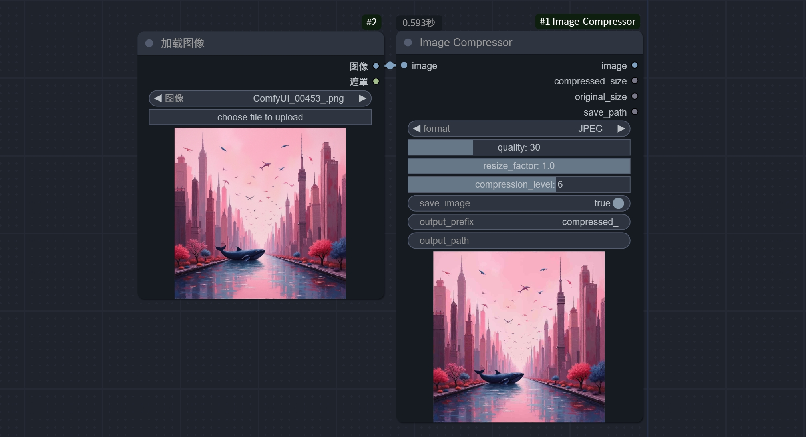

# ComfyUI Image Compressor Node

[English](README_en.md) | 中文

一个用于图像压缩的ComfyUI自定义节点，支持多种压缩格式和参数调整。

> 直接拖入ComfyUI

## 功能特点

- 支持多种图像格式（PNG、WEBP、JPEG）的压缩
- 可调整图像质量和压缩级别
- 支持图像尺寸调整
- 自定义输出路径和文件名前缀
- 显示压缩前后的文件大小

## 安装方法

1. 将本插件复制到 ComfyUI 的 `custom_nodes` 目录下
2. 重启 ComfyUI
3. 在节点列表中找到压缩节点:
   - 路径: image/processing/Image Compressor (单图压缩节点)
   - 路径: image/processing/Batch Image Compressor (批量压缩节点)

## 节点类型

### 单图压缩节点 (Image Compressor)

#### 输入参数
- **image**: 输入图像
- **save_image**: 是否保存压缩后的图像文件（默认：是）
- **output_prefix**: 输出文件名前缀（默认：compressed_）
- **output_path**: 自定义输出路径（可选，默认使用 ComfyUI 的 output/compressed 目录）

#### 输出信息
- 压缩后的图像
- 压缩后的文件大小
- 原始文件大小
- 保存路径（如果启用了保存）

### 批量压缩节点 (Batch Image Compressor)

#### 输入参数
- **input_path**: 输入图像目录路径
  - 支持处理目录下的所有图像文件
  - 自动识别 PNG、JPEG、WEBP 格式
  - 会递归处理子目录中的图像
- **save_image**: 是否保存压缩后的图像文件（默认：是）
- **output_prefix**: 输出文件名前缀（默认：compressed_）
- **output_path**: 自定义输出路径（可选）

#### 输出信息
- 处理结果摘要，包含每个文件的处理状态
- 输出目录路径

### 通用压缩参数

#### 格式选择 (format)
- **PNG**: 无损压缩，适合需要保持图像质量的场景
  - 优点：无损压缩，支持透明度
  - 缺点：文件体积相对较大
  - 适用场景：图标、截图、需要保持完美质量的图像

- **WEBP**: Google开发的现代图像格式
  - 优点：较好的压缩率，支持有损和无损压缩
  - 缺点：兼容性可能不如PNG和JPEG
  - 适用场景：网页图像、需要在质量和体积间平衡的场景

- **JPEG**: 常用的有损压缩格式
  - 优点：高压缩率，文件体积小
  - 缺点：有损压缩，不支持透明度
  - 适用场景：照片、不需要透明度的图像

#### 质量控制
- **quality**: 压缩质量（1-100，默认：85）
  - 对 JPEG 和 WEBP 格式有效
  - 值越高，质量越好，文件越大
  - 建议值：
    - 高质量：85-95
    - 平衡质量：75-85
    - 高压缩：60-75

- **compression_level**: PNG压缩级别（0-9，默认：6）
  - 只对 PNG 格式有效
  - 值越高，压缩率越高，但压缩时间更长
  - 建议值：
    - 快速压缩：3-4
    - 平衡压缩：6
    - 最大压缩：9

- **resize_factor**: 尺寸调整因子（0.1-1.0，默认：1.0）
  - 1.0 表示保持原始尺寸
  - 小于 1.0 时会按比例缩小图像
  - 可用于通过降低分辨率来减小文件大小

## 使用建议

1. **格式选择**:
   - 需要无损压缩：使用 PNG
   - 网页图像：优先使用 WEBP
   - 照片类图像：使用 JPEG

2. **质量设置**:
   - PNG：调整 compression_level，建议使用 6-9
   - WEBP：quality 设置 80-90 可获得较好的平衡
   - JPEG：quality 设置 75-85 通常够用

3. **文件大小优化**:
   - 首先尝试调整 quality 参数
   - 如果仍然太大，可以考虑调整 resize_factor
   - 最后考虑更换压缩格式

## 注意事项

- 输出目录会自动创建
- 文件名包含时间戳和计数器，确保不会覆盖已有文件
- 建议根据具体使用场景选择合适的压缩参数