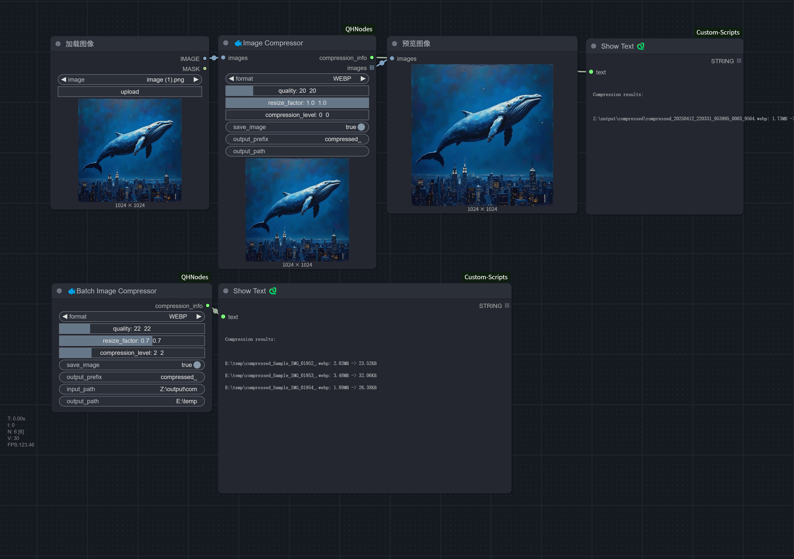

# ComfyUI Image Compressor Node

English | [中文](README.md)

A ComfyUI custom node for image compression, supporting multiple formats and adjustable parameters.

> Drag and drop directly into ComfyUI

## Features

- Support multiple image formats (PNG, WEBP, JPEG)
- Adjustable image quality and compression levels
- Support image resizing
- Custom output path and filename prefix
- Display file size before and after compression
- Support batch image processing
- Automatic transparency handling
- Smart handling of various input formats (RGB/RGBA)

## Installation

1. Copy this plugin to ComfyUI's `custom_nodes` directory
2. Restart ComfyUI
3. Find compression nodes in the node list:
   - Path: image/processing/Image Compressor (Single image compression node)
   - Path: image/processing/Batch Image Compressor (Batch compression node)

## Node Types

### Image Compressor Node

#### Input Parameters
- **images**: Input image(s) (supports single or batch images)
- **format**: Output format selection (PNG/WEBP/JPEG)
- **quality**: Compression quality (1-100)
- **resize_factor**: Size adjustment factor (0.1-1.0)
- **compression_level**: Compression level (0-9, PNG only)
- **save_image**: Whether to save the compressed image file (Default: Yes)
- **output_prefix**: Output filename prefix (Default: compressed_)
- **output_path**: Custom output path (Optional, defaults to ComfyUI's output/compressed directory)

#### Output Information
- **compression_info**: Compression information string, including:
  - Compressed file size
  - Original file size
  - Save path (if saving is enabled)
  - Compression ratio information

### Batch Image Compressor Node

#### Input Parameters
- **input_path**: Input image directory path
  - Processes all image files in the directory
  - Automatically recognizes PNG, JPEG, WEBP formats
  - Recursively processes images in subdirectories
- **format**: Output format selection (PNG/WEBP/JPEG)
- **quality**: Compression quality (1-100)
- **resize_factor**: Size adjustment factor (0.1-1.0)
- **compression_level**: Compression level (0-9, PNG only)
- **save_image**: Whether to save the compressed image files (Default: Yes)
- **output_prefix**: Output filename prefix (Default: compressed_)
- **output_path**: Custom output path (Optional)

#### Output Information
- Processing result summary, including status for each file
- Output directory path

### Common Compression Parameters

#### Format Selection (format)
- **PNG**: Lossless compression, suitable for scenarios requiring image quality preservation
  - Pros: Lossless compression, supports transparency
  - Cons: Relatively larger file size
  - Use cases: Icons, screenshots, images requiring perfect quality
  - Features: Uses compression_level parameter to control compression strength

- **WEBP**: Modern image format developed by Google
  - Pros: Good compression ratio, supports both lossy and lossless compression, transparency support
  - Cons: Compatibility might not be as good as PNG and JPEG
  - Use cases: Web images, scenarios requiring balance between quality and size
  - Features: Supports both quality and alpha_quality parameters

- **JPEG**: Common lossy compression format
  - Pros: High compression ratio, small file size
  - Cons: Lossy compression, no transparency support (transparent areas converted to white background)
  - Use cases: Photos, images not requiring transparency
  - Features: Uses quality parameter and optimized subsampling settings

#### Quality Control
- **quality**: Compression quality (1-100, Default: 85)
  - Effective for JPEG and WEBP formats
  - Higher value means better quality but larger file size
  - Recommended values:
    - High quality: 85-95
    - Balanced quality: 75-85
    - High compression: 60-75

- **compression_level**: PNG compression level (0-9, Default: 6)
  - Only effective for PNG format
  - Higher value means higher compression ratio but longer compression time
  - Recommended values:
    - Fast compression: 3-4
    - Balanced compression: 6
    - Maximum compression: 9

- **resize_factor**: Size adjustment factor (0.1-1.0, Default: 1.0)
  - 1.0 means keeping original size
  - Values less than 1.0 will proportionally reduce image size
  - Can be used to reduce file size by lowering resolution

## Usage Recommendations

1. **Format Selection**:
   - Need lossless compression: Use PNG
   - Web images: Prefer WEBP
   - Photo-type images: Use JPEG

2. **Quality Settings**:
   - PNG: Adjust compression_level, recommend 6-9
   - WEBP: quality setting 80-90 provides good balance
   - JPEG: quality setting 75-85 is usually sufficient

3. **File Size Optimization**:
   - First try adjusting quality parameter
   - If still too large, consider adjusting resize_factor
   - Finally consider changing compression format

## Notes

- Output directory is created automatically
- Filenames include timestamp and counter to avoid overwriting existing files
- Recommend selecting appropriate compression parameters based on specific use cases